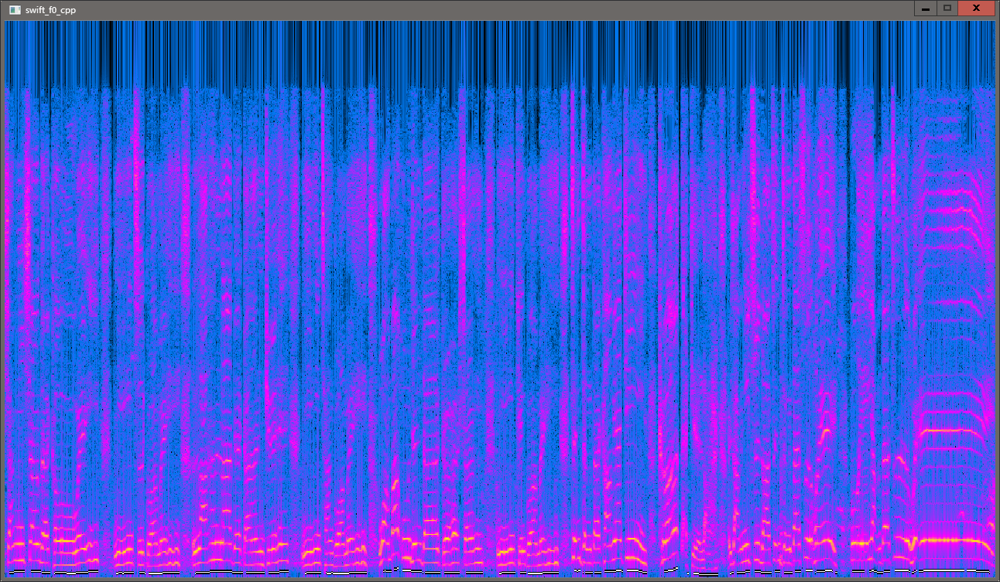
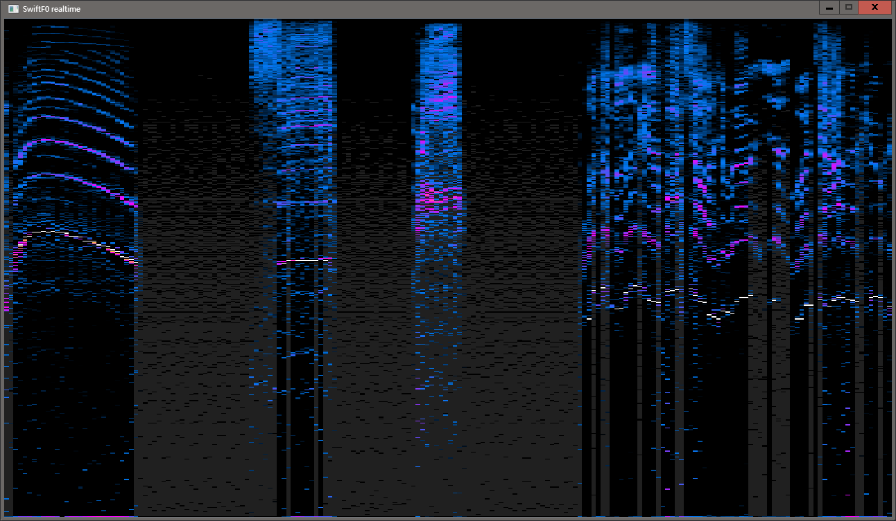

# swift_f0_cpp
test using swift_f0 model to detect pitch  

## static

## realtime
it seems that swift-f0 may not realtime running in traditional audio DSP, it consumes my 38% cpu(i5-11300H).  
and this model have a 1024 samples latency(64ms in 48kHz).  

## credits
[swift-f0](https://github.com/lars76/swift-f0)